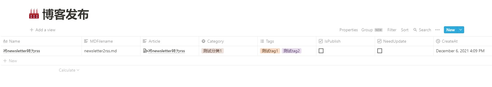

# NotionToGithubBlog

自动化拉取Notion Database中的文章，转化为markdown

可以用于 Notion 到 Hugo/Hexo 等静态博客的自动化发布

是否有这样的烦恼：在notion中写了一篇笔记或文章，想要发布到github静态博客上，发现需要先将文章转化成markdown，图片需要上传到图床，然后贴入markdown，然后再推送到github，等待action自动构建静态博客

这个action旨在部分自动化这个流程（全部自动化需要配合其他的action和操作）

只需要在 notion 中建立一个用于博客发布的 database，然后写完笔记后填入这个 database，再使用一些手段触发 CI 即可完成博客文章的发布

如果把你的静态博客比作一个cms，那么这个 notion database 就是 cms 的内容管理后端（目前只支持增加和更新文章）

## 使用

要使用该action，首先你需要在 notion 中创建一个 database，这个 database 需要有几个字段，字段名如下:

- Name (title): 文章标题
- Article (text): 文章链接
- MDFilename (text): 创建的 markdown 文件名
- Category (select): 文章分类
- Tags (multi_select): 文章标签
- IsPublish (checkbox): 文章是否发布
- NeedUpdate (checkbox): 文章是否有更新
- CreateAt (Created time): 创建时间
- UpdateAt (Last edited time): 更新时间

默认当 `IsPublish` 未勾选或 `NeedUpdate` 勾选的项目才会触发流程，即 `IsPublish=false || NeedUpdate=true` 时触发

样例如下



然后你需要在你存放博客源文件的仓库进行一些设置，放置上workflows

下面以我的github博客仓库 [akkuman/akkuman.github.io](https://github.com/akkuman/akkuman.github.io) 为例进行说明

我的仓库原始action作用为：当hugo分支上触发push事件，则自动构建博客推送到master分支

然后我们创建一个workflows: [akkuman/akkuman.github.io/.github/workflows/xxx.yml](https://github.com/akkuman/akkuman.github.io/blob/hugo/.github/workflows/notion_to_blog.yml)

```yaml
name: Notion To Blog

on:
  issues:
    types: [opened]

jobs:
  notion-to-blog:
    if: ${{ github.event.issue.user.login == github.actor && contains(github.event.issue.title, 'notion-ci') }}
    runs-on: ubuntu-latest

    steps:
    - uses: actions/checkout@v2
      with:
        # Workflows are only triggered when commits (and tags I think, but it would need to be tested) are created pushed using a Personal Access Token (PAT).
        # ref: https://github.com/EndBug/add-and-commit/issues/311#issuecomment-948749635
        token: ${{ secrets.CHECKOUT_TOKEN }}

    - name: Markdown From Notion
      uses: akkuman/notion_to_github_blog@master
      with:
        notion_token: ${{ secrets.NOTION_TOKEN }}
        notion_database_id: ${{ secrets.NOTION_DATABASE_ID }}
        img_store_type: github
        img_store_path_prefix: notionimg
        # img_store_url_path_prefix: ${{ secrets.IMG_STORE_URL_PATH_PREFIX }}
        # Actions run as an user, but when they are running in a fork there are potential security problems, so they are degraded to "read-only"
        # ref: https://github.com/actions/first-interaction/issues/10#issuecomment-546628432
        # ref: https://docs.github.com/en/actions/security-guides/automatic-token-authentication#permissions-for-the-github_token
        # so you should set another token
        img_store_github_token: ${{ secrets.CHECKOUT_TOKEN }}
        img_store_github_repo: akkuman/pic
        img_store_github_branch: master
        # md_store_path_prefix: ${{ secrets.MD_STORE_PATH_PREFIX }}

    - name: push to github
      uses: EndBug/add-and-commit@v7
      with:
        branch: hugo
        message: 'Notion CI'
```

字段解释：
- **notion_token**: notion申请的app的api token
- **notion_database_id**: notion中需要作为博客发布的database的id，这是一个uuid，可以通过Share->Copy link获取，注意需要把其中的id转化为uuid的格式，比如 Copy link出来为 `https://www.notion.so/akkuman/7bf568e946b946189b2b4af0c61b9e78?v=c45b5e45e96541f4bf81994ab4af1a6e`，则notion_database_id为 `7bf568e9-46b9-4618-9b2b-4af0c61b9e78`，并且你所要发布的文章以及该database都需要invite我们上面申请的app（为了token能够获取到内容）
- **img_store_type**: notion中提取出来的图片保存到哪，可选 local 或者 github，local代表保存到源仓库，github代表保存到另一个github仓库（图床）中去，默认为 `local`
- **img_store_path_prefix**: 图片保存的路径前缀，默认为 `static/notionimg`
- **img_store_url_path_prefix**： 当 `img_store_type=local` 时需要，设置在markdown图片链接中的前缀，和上面的 `img_store_path_prefix` 不相同，比如 `img_store_path_prefix='static/notionimg' img_store_url_path_prefix：='/notionimg/'` 的情况下，则图片保存路径为 './static/notionimg/{img_md5}{img_ext}', 而在markdown文件中的体现为 ``
- **img_store_github_token**: 当 `img_store_type=github` 时需要，设置保存图片到github图床所使用的token（`secrets.GITHUB_TOKEN` 只有读权限，所以需要另外使用）
- **img_store_github_repo**: 当 `img_store_type=github` 时需要，你把哪个仓库当作github图床
- **img_store_github_branch**: 当 `img_store_type=github` 时需要，你把哪个github图床仓库的哪一个分支当作图床
- **md_store_path_prefix**: 最后生成的markdown文件保存在哪，默认是当前仓库目录的 `content/posts` 目录下

其中需要关注的是

1. `token: ${{ secrets.CHECKOUT_TOKEN }}` 是为了后面的 `push to github` 推送后能够触发另外一个action流程，否则无法触发，其中的 `CHECKOUT_TOKEN` 为你创建的 Personal Access Token，具体可以查看我上面的注释
2. `on: issues: types: [opened]` 的主要作用是当打开或提交一个issue时触发该action，**注意**: 只有当该workflows在主分支时，使用 `issues` 作为触发条件才会生效，我个人是将 `hugo` 作为主分支，将 `master` 作为 `Github Pages` 分支
3. `if: ${{ github.event.issue.user.login == github.actor && contains(github.event.issue.title, 'notion-ci') }}` 的主要作用是：当提交issue的人是你自己，并且issue标题包含 notion-ci 时进行action流程
